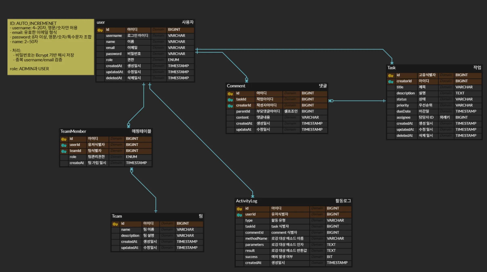

# Dev Log API

> Task 관리 시스템 TaskFlow의 REST API 백엔드 서버 Dev Log 개발 프로젝트


<!-- TOC -->

- [Dev Log API](#dev-log-api)
    - [1. 프로젝트 개요](#1-프로젝트-개요)
    - [2. 주요 기능 및 주안점](#2-주요-기능-및-주안점)
        - [2.1 주요 기능](#21-주요-기능)
        - [2.2 개발 주안점](#22-개발-주안점)
    - [3. 개발 환경](#3-개발-환경)
    - [4. 프로젝트 구조 및 실행 방법](#4-프로젝트-구조-및-실행-방법)
        - [4.1 프로젝트 구조](#41-프로젝트-구조)
        - [4.2 실행 방법](#42-실행-방법)
    - [5. 주요 설계](#5-주요-설계)
        - [5.1 ERD](#51-erd)
        - [5.2 REST API](#52-rest-api)
    - [6. Git 그라운드 룰](#6-git-그라운드-룰)
    - [7. 팀원](#7-팀원)

<!-- /TOC -->

## 1. 프로젝트 개요

- UI 개발이 완료된 Task 관리 시스템 TaskFlow의 API 서버 구축
- UI와 REST API로 작성된 명세서를 바탕으로 Spring Boot 기반의 API 서버를 개발
- Spring Data JPA와 Spring Security 기반의 인증/인가 시스템을 갖추고 있음

## 2. 주요 기능 및 주안점

### 2.1 주요 기능

👤 사용자 관리 및 인증/인가

- [x] 회원가입 (Password BCrypt 암호화)
- [x] 로그인 (JWT)
- [x] 회원탈퇴 (Soft delete)
- [x] 내 정보 조회
- [x] @AuthenticationPrincipal을 통한 사용자 정보 접근
- [x] USER, ADMIN 역할 구분

👥 팀 관리

- [x] 팀 생성
- [x] 팀 조회
- [x] 팀 수정
- [x] 팀 삭제
- [x] 팀 멤버 추가/삭제 (중복 방지, 존재 여부 검증)
- [x] 팀에 속하지 않은 사용자 조회

✅ 작업(Task) 관리

- [x] 작업 생성
- [x] 작업 조회 (검색, 페이징)
- [x] 작업 수정
- [x] 작업 삭제 (Soft delete)
- [x] 상태 변경 (TODO -> IN PROGRESS -> DONE 순차적 변경 허용)

💬 댓글(Comment) 관리

- [x] 댓글 및 대댓글 작성
- [x] 댓글 조회 (페이지네이션)
- [x] 댓글 수정 (본인 댓글)
- [x] 댓글 삭제 (본인 댓글, 대댓글도 함께 삭제)

📊 대시보드 및 검색

- [x] 전체 Task 통계
- [x] 상태별 Task 수
- [x] 완료율
- [x] 기한 초과 task 수
- [x] 검색 결과 제공 (작업 / 유저 / 팀)

📜 활동 로그

- [x] Spring AOP를 활용한 자동 로깅 (Task/Comment 생성, 수정, 삭제, 상태 변경 등)
- [x] 권한별 활동 로그 조회 (페이지네이션/필터링)

### 2.2 개발 주안점

- **요구사항 분석 단계**
    - 요구사항 정의서 해석 정확성
    - API 및 ERD 설계의 일관성 및 적합성
- **기능 구현 단계**
    - 주요 API 정상 동작 (회원가입/로그인/태스크/댓글/팀/활동 로그)
    - 데이터베이스 연동 및 ERD 설계 반영
    - 테스트 코드 커버리지 (최소 30% 이상)
- **프론트엔드 연동 단계**
    - 프론트엔드(Docker) 실행 시 API 정상 연동
    - JWT 기반 인증 흐름 구현 (로그인/프로필)
    - UI 상에서 CRUD 및 통계/로그 기능 확인
- **코드 품질 및 확장성**
    - 예외 처리 일관성 및 에러 응답 포맷 준수
    - 보안 요건 충족 (비밀번호 암호화, JWT 인증)
    - 유지보수/확장성을 고려한 패키지 구조 및 설계

## 3. 개발 환경

- Java 17
- Spring Boot 3.5.5
- MySQL 8.0.42
- Spring Data JPA 3.5.3
- Spring AOP 6.2.10
- Spring Security 6.5.3
- Junit5
- JWT
- Gradle
- Github
- Docker
- Postman

## 4. 프로젝트 구조 및 실행 방법

### 4.1 프로젝트 구조

프로젝트는 크게 **common**과 **domain** 두 개의 최상위 패키지로 구성

- common: 여러 도메인에서 공통적으로 사용되는 클래스를 관리
    - 보안 설정, 공통 응답 DTO, 전역 예외 처리 등
- domain: 실제 비즈니스 로직을 처리하는 도메인별 패키지를 관리
    - 각 도메인은 독립적으로 Controller, Service, Repository, Entity, DTO 등 필요한 레이어로 구성

```text
 devlog/
 ├── DevLogApplication.java
 ├── common/
 │   ├── annotation/
 │   ├── code/
 │   ├── config/
 │   ├── dto/
 │   ├── entity/
 │   ├── exception/
 │   ├── security/
 │   ├── type/
 │   └── util/
 └── domain/
     ├── actlog/
     ├── auth/
     ├── comment/
     ├── dashboard/
     ├── search/
     ├── task/
     ├── team/
     └── user/
```

### 4.2 실행 방법

- 백엔드 서버 실행

```shell
# 1. 프로젝트 클론
git clone https://github.com/dev-log-2/dev-log.git
cd dev-log

# 2. application-local.yml 파일 생성
# src/main/resources/application-local.yml.template 파일을 복사하여
# application-local.yml 파일을 생성하고, 정보를 입력해주세요.

# 3. 백엔드 서버 실행
./gradlew bootRun

```

-프론트엔드 실행 (Docker)

```shell
# 1. 프론트엔드 이미지 다운로드
docker pull parksunggyu/taskflow-fe:tagname

# 2. 컨테이너 실행
docker run -d -p 3000:3000 parksunggyu/taskflow-fe:tagname

# 3. 브라우저에서 접속
# http://localhost:3000


```

## 5. 주요 설계

### 5.1 ERD



### 5.2 REST API

- API 명세 요약은 아래와 같으며, 모든 응답은 표준화된 공통 응답 형식을 따릅니다.
- 상세 명세는 [링크](https://teamsparta.notion.site/Kotlin-8-2622dc3ef514804f9d68e58f2bc713e2?source=copy_link)를 통해 확인할 수 있습니다.

```json lines
{
  "success": true,
  // boolean
  "message": "성공 메시지",
  // string
  "data": {},
  // 실제 데이터 (null 가능)
  "timestamp": "2024-03-21T10:00:00Z"
  // ISO 8601 형식
}
```

**👤 유저 & 인증 (Auth & User)**

| 기능        | HTTP Method | 엔드포인트 (Endpoint URI) | 설명                      |
|-----------|-------------|----------------------|-------------------------|
| 회원가입      | `POST`      | `/api/auth/register` | 새로운 사용자를 등록합니다.         |
| 로그인       | `POST`      | `/api/auth/login`    | 사용자 인증 후 JWT를 발급합니다.    |
| 회원탈퇴      | `DELETE`    | `/api/auth/withdraw` | 현재 로그인된 사용자를 탈퇴 처리합니다.  |
| 내 정보 조회   | `GET`       | `/api/users/me`      | 현재 로그인된 사용자의 정보를 조회합니다. |
| 사용자 목록 조회 | `GET`       | `/api/users`         | 팀 초대를 위한 사용자 목록을 조회합니다. |

Sheets로 내보내기

**✅ 작업 (Task)**

| 기능         | HTTP Method | 엔드포인트 (Endpoint URI)                                           | 설명                     |
|------------|-------------|----------------------------------------------------------------|------------------------|
| Task 생성    | `POST`      | `/api/tasks`                                                   | 새로운 Task를 생성합니다.       |
| Task 목록 조회 | `GET`       | `/api/tasks?status=TODO&page=0&size=10&search=기획&assigneeId=1` | 조건부로 Task 목록을 조회합니다.   |
| Task 상세 조회 | `GET`       | `/api/tasks/{taskId}`                                          | 특정 Task의 상세 정보를 조회합니다. |
| Task 수정    | `PUT`       | `/api/tasks/{taskId}`                                          | 특정 Task의 정보를 수정합니다.    |
| Task 상태 변경 | `PATCH`     | `/api/tasks/{taskId}/status`                                   | 특정 Task의 상태를 변경합니다.    |
| Task 삭제    | `DELETE`    | `/api/tasks/{taskId}`                                          | 특정 Task를 삭제합니다.        |

**💬 댓글 (Comment)**

| 기능       | HTTP Method | 엔드포인트 (Endpoint URI)                                      | 설명                           |
|----------|-------------|-----------------------------------------------------------|------------------------------|
| 댓글 생성    | `POST`      | `/api/tasks/{taskId}/comments`                            | 특정 Task에 댓글 또는 대댓글을 생성합니다.   |
| 댓글 목록 조회 | `GET`       | `/api/tasks/{taskId}/comments?page=0&size=10&sort=newest` | 특정 Task의 댓글 목록을 계층적으로 조회합니다. |
| 댓글 수정    | `PUT`       | `/api/tasks/{taskId}/comments/{commentId}`                | 특정 댓글을 수정합니다.                |
| 댓글 삭제    | `DELETE`    | `/api/tasks/{taskId}/comments/{commentId}`                | 특정 댓글과 하위 대댓글들을 삭제합니다        |

**👥 팀 (Team)**

| 기능               | HTTP Method | 엔드포인트 (Endpoint URI)                   | 설명                          |
|------------------|-------------|----------------------------------------|-----------------------------|
| 팀 생성             | `POST`      | `/api/teams`                           | 새로운 팀을 생성합니다.               |
| 팀 목록 조회          | `GET`       | `/api/teams`                           | 내가 속한 팀 목록을 조회합니다.          |
| 특정 팀 조회          | `GET`       | `/api/teams/{teamId}`                  | 특정 팀의 상세 정보를 조회합니다.         |
| 팀 정보 수정          | `PUT`       | `/api/teams/{teamId}`                  | 특정 팀의 정보를 수정합니다.            |
| 팀 삭제             | `DELETE`    | `/api/teams/{teamId}`                  | 특정 팀을 삭제합니다.                |
| 팀 멤버 추가          | `POST`      | `/api/teams/{teamId}/members`          | 특정 팀에 멤버를 초대합니다.            |
| 팀 멤버 제거          | `DELETE`    | `/api/teams/{teamId}/members/{userId}` | 특정 팀에서 멤버를 제거합니다.           |
| 팀 멤버 목록 조회       | `GET`       | `/api/teams/{teamId}/members`          | 특정 팀의 멤버 목록을 조회합니다.         |
| 추가 가능한 사용자 목록 조회 | `GET`       | `/api/users/available?teamId={teamId}` | 해당 팀에 추가 가능한 사용자 목록을 조회합니다. |

**📊 대시보드**

| 기능          | HTTP Method | 엔드포인트 (Endpoint URI)                       | 설명                               |
|-------------|-------------|--------------------------------------------|----------------------------------|
| 대시보드 통계 조회  | `GET`       | `/api/dashboard/stats`                     | 대시보드 KPI 통계 정보를 조회합니다.           |
| 내 작업 요약 조회  | `GET`       | `/api/dashboard/my-tasks`                  | 대시보드의 내 작업 목록을 조회합니다.            |
| 통합 검색       | `GET`       | `/api/search`                              | 키워드로 Task, User, Team을 통합 검색합니다. |
| 최근 활동 조회    | `GET`       | `/api/dashboard/activities?page=0&size=10` | 최근 활동을 조회합니다.                    |
| 팀 진행률 조회    | `GET`       | `/api/dashboard/team-progress`             | 팀별 진행률을 조회합니다.                   |
| 주간 작업 추세 조회 | `GET`       | `/api/dashboard/weekly-trend`              | 주간 작업 추세를 조회합니다.                 |

**🔍검색, 로그**

| 기능          | HTTP Method | 엔드포인트 (Endpoint URI)                                                                                         | 설명                       |
|-------------|-------------|--------------------------------------------------------------------------------------------------------------|--------------------------|
| 활동 로그 조회    | `GET`       | `/api/activities?page=0&size=10&type=TASK_CREATED&userId=1&taskId=1&startDate=2025-09-09&endDate=2025-09-09` | 활동 로그를 조건부/페이지네이션 조회합니다. |
| 통합 검색       | `GET`       | `/api/search?q={query}`                                                                                      | 검색어를 통해 통합 검색 결과를 조회합니다. |
| 작업 검색 (페이징) | `GET`       | `/api/tasks/search?q={query}&page=0&size=10`                                                                 | 작업 검색 결과를 페이지네이션 조회합니다.  |

## 6. Git 그라운드 룰

- **Git Flow**: main ← develop ← feat/{issue-number}

- **Commit Message**: type: Subject (예: feat: jwt 로그인 기능 추가)

- **Pull Request**: PR 템플릿을 준수하고, close #{issue-number} 키워드를 사용하여 이슈를 자동으로 닫음

- **Project Management**: GitHub Issues & Projects 를 사용하여 issue 기반으로 작업을 생성하고 관리

## 7. 팀원

| 이름	     | 역할	                     | GitHub                                          |
|---------|-------------------------|-------------------------------------------------|
| **김**필선 | Auth/User, ActivityLog  | [seonrizee](https://github.com/seonrizee)       |
| **박**수현 | Team, Dashboard         | [soo59599](https://github.com/soo59599)         |
| **이**영래 | Task, Dashboard, Search | [youngrae0317](https://github.com/youngrae0317) |
| **백**도현 | Comment, Dashboard      | [8646066468](https://github.com/8646066468)     |